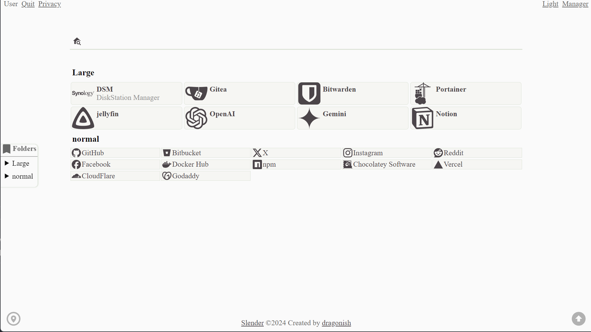
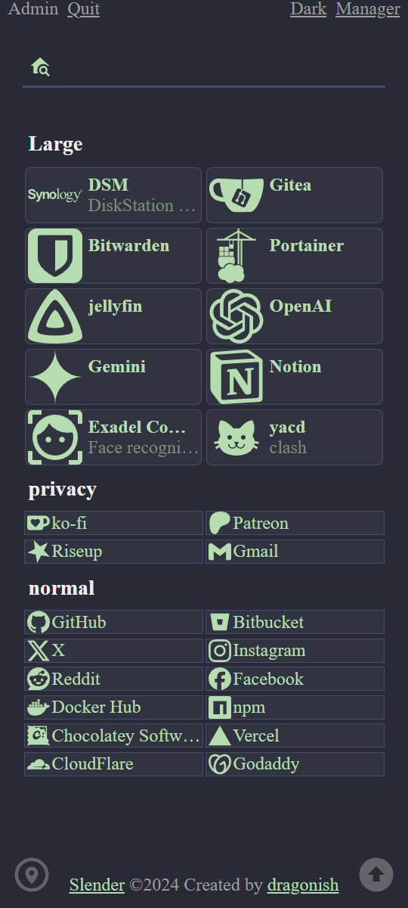

# slender-go

<p align="center"><b>English</b> 👈(ﾟヮﾟ👈) | <a href="./README-zh_CN.md">简体中文</a></p>

Personal website navigation.

## Preview





## Feature

- Allow defining [access password](#access-password) and [admin password](#admin-password).
- Support [dynamic link](#dynamic-link) function.
- Support privacy mode function.
- Support searching for bookmark items within the homepage.
- Built-in [MaterialDesign](https://github.com/Templarian/MaterialDesign) and [simple-icons](https://github.com/simple-icons/simple-icons) icons, and allows custom or upload icons.
- Allows custom web search engines.
- Allows to custom the code in the home footer element.
- Optional folder sidebar.
- Optional display of latest bookmarks and hot bookmarks.

## Installation

### Docker deployment

Pull image:

```bash
docker pull giterhub/slender:latest
```

Create the [`compose.yaml`](./compose.yaml) file and run:

```bash
docker compose up -d
```

Support defining [environment variables](#environment-variables) or [service configuration](#service-configuration) or adding [startup commands](#startup-commands).

### Local compile

Install [git](https://git-scm.com) and [Go](https://go.dev) locally and run:

```bash
# Clone project code
git clone https://github.com/dragonish/slender-go.git

# Enter project directory
cd slender-go

# At the first time or update version
./download.sh

# Run
CGO_ENABLED=1 go run main.go
```

Support defining [environment variables](#environment-variables) or [service configuration](#service-configuration) or adding [startup commands](#startup-commands).

## Environment variables

| Name | Type | Default | Description |
| --- | --- | --- | --- |
| `SLENDER_ACCESS_PWD` | `string` | `""` | Access password |
| `SLENDER_ADMIN_PWD` | `string` | `""` | Admin password |
| `SLENDER_LOG_LEVEL` | `string` | `Info` | Log output level. Optional: `Debug`, `Info`, `Warn`, `Error` |
| `SLENDER_PORT` | `int` | `8080` | Web service running port |
| `SLENDER_TOKEN_AGE` | `int` | `30` | Token age (days) |
| `SLENDER_PERFORMANCE_MODE` | `string` | `0` | Enable performance mode when a truthy value (`1, yes, true, on`). *It is recommended to enable only when the database update performance is bad* |
| `SLENDER_SERVICE_CONFIG` | `string` | `./slender.yaml` | Specify service config file path |

## Service configuration

> *Service configuration take precedence over environment variables.*

The service configuration file can be defined as a YAML or JSON format file.

### YAML format

By default, the program reads `slender.yaml` in the program directory as the service configuration file (if it exists). If you need to use a service configuration file located elsewhere, specify its file path either by [environment variables](#environment-variables) or adding [startup commands](#startup-commands).

Each field in the file is optional. The file can declare fields as follows:

```yaml
access_password: string # Access password
admin_password: string # Admin password
log_level: Debug|Info|Warn|Error # Log output level
port: number # Web service running port
token_age: number # Token age (days)
performance_mode: true # Performance mode. It is recommended to enable only when the database update performance is bad
```

### JSON format

If you want to use a service configuration file in JSON format, specify its file path either by [environment variables](#environment-variables) or adding [startup commands](#startup-commands).

Each field in the file is optional. The file can declare fields as follows:

```js
{
  "accessPassword": "string", // Access password
  "adminPassword": "string", // Admin password
  "logLevel": "Debug|Info|Warn|Error", // Log output level
  "port": 8080, // Web service running port
  "tokenAge": 30, // Token age (days)
  "performanceMode": true, // Performance mode. It is recommended to enable only when the database update performance is bad
}
```

## Startup commands

> *Startup commands take precedence over service configuration and environment variables.*

| Name | Type | Description |
| --- | --- | --- |
| `--debug, -D` || Enable debug mode |
| `--version, -v` || Show application version |
| `--help, -h` || Show help document |
| `--performance, -P` || Enable performance mode. *It is recommended to enable only when the database update performance is bad* |
| `--config, -c` | `string` | Specify service config file path |
| `--access_pwd, -a` | `string` | Specify access password |
| `--admin_pwd, -d` | `string` | Specify admin password |
| `--token_age, -t` | `int` | Specify token age (days) |
| `--log, -l` | `string` | Specify log output level. Optional: `Debug`, `Info`, `Warn`, `Error` |
| `--port, -p` | `int` | Specify web service running port |

## Access password

Used to access the homepage. If not defined, it can be accessed directly by default.

## Admin password

Used to access backend management and enter privacy mode.

If no admin password is set, it defaults to the access password(non-empty) or `p@$$w0rd`.

## Dynamic link

Convert dynamic links and display them according to the network environment.

Suppose the homepage address of the Slender service is `https://192.168.0.1:8080/`, the following available parameters and their corresponding results:

| parameter | result |
| --- | --- |
| `host` | `192.168.0.1:8080` |
| `hostname` | `192.168.0.1` |
| `href` | `https://192.168.0.1:8080/` |
| `origin` | `https://192.168.0.1:8080` |
| `pathname` | `/` |
| `port` | `8080` |
| `protocol` | `https:` |

**Example**

If a bookmark URL is configured as `https://{hostname}:8888/test`:

- When the homepage of the Slender service is `https://192.168.0.1:8080/`, it appears as `https://192.168.0.1:8888/test`.
- When the homepage of the Slender service is `https://172.17.0.1:8080/`, it appears as `https://172.17.0.1:8888/test`.
- When the homepage of the Slender service is `https://link.example.com/`, it appears as `https://link.example.com:8888/test`.

## Credits

- [soulteary/flare](https://github.com/soulteary/flare)
- [simple-icons/simple-icons](https://github.com/simple-icons/simple-icons)
- [Templarian/MaterialDesign](https://github.com/Templarian/MaterialDesign)

## License

[GPL-3.0 license](./LICENSE)
