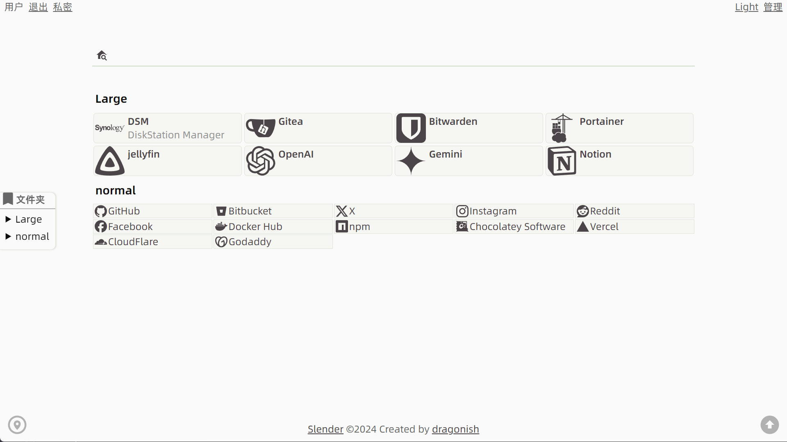
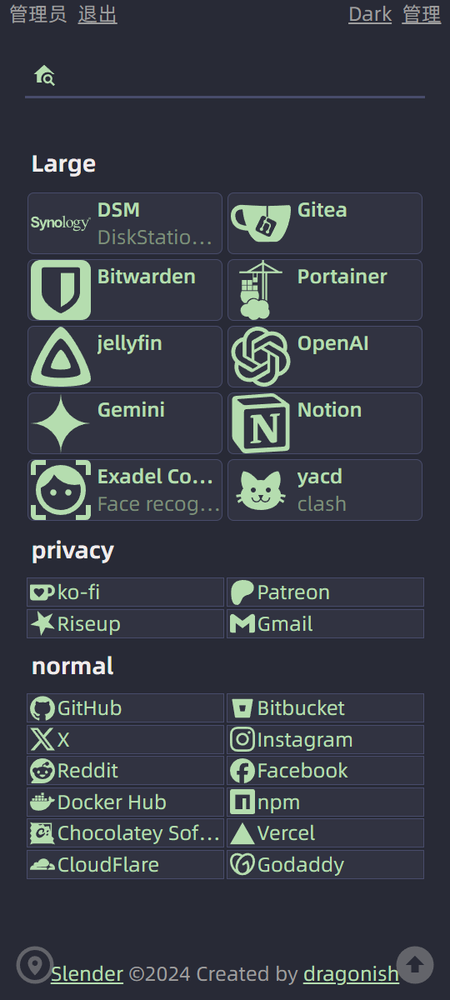

# slender-go

<p align="center"><a href="./README.md">English</a> | (👉ﾟヮﾟ)👉 <b>简体中文</b></p>

个人网站导航。

## 预览






## 特性

- 允许定义[访问密码](#访问密码)与[管理员密码](#管理员密码)。
- 支持[动态链接](#动态链接)功能。
- 支持隐私模式功能。
- 支持搜索首页内的书签项目。
- 内置 [MaterialDesign](https://github.com/Templarian/MaterialDesign) 与 [simple-icons](https://github.com/simple-icons/simple-icons) 图标，并允许自定义或上传图标。
- 允许自定义网络搜索引擎。
- 允许自定义首页页脚元素中的代码。
- 可选的文件夹侧边栏。
- 可选的展示最近添加书签和热门书签。

## 安装

### Docker 部署

拉取镜像：

```bash
docker pull giterhub/slender:latest
```

创建 [`compose.yaml`](./compose.yaml) 并运行：

```bash
docker compose up -d
```

支持定义[环境变量](#环境变量)或[服务配置](#服务配置)或添加[启动命令](#启动命令)。

### 本地编译运行

本地安装 [git](https://git-scm.com) 与 [Go](https://go.dev) 并运行：

```bash
# Clone project code
git clone https://github.com/dragonish/slender-go.git

# Enter project directory
cd slender-go

# At the first time or update version
./download.sh

# Run
CGO_ENABLED=1 go run main.go
```

支持定义[环境变量](#环境变量)或[服务配置](#服务配置)或添加[启动命令](#启动命令)。

## 环境变量

| 变量名 | 值类型 | 默认值 | 描述 |
| --- | --- | --- | --- |
| `SLENDER_ACCESS_PWD` | `string` | `""` | 访问密码 |
| `SLENDER_ADMIN_PWD` | `string` | `""` | 管理员密码 |
| `SLENDER_LOG_LEVEL` | `string` | `Info` | 日志输出级别，可选值：`Debug`、`Info`、`Warn`、`Error` |
| `SLENDER_PORT` | `int` | `8080` | Web 服务运行端口 |
| `SLENDER_TOKEN_AGE` | `int` | `30` | 令牌保存期限 (天) |
| `SLENDER_PERFORMANCE_MODE` | `string` | `0` | 为真值(`1, yes, true, on`)时启用性能模式。*建议仅在遇到数据库更新性能不佳时才开启* |
| `SLENDER_SERVICE_CONFIG` | `string` | `./slender.yaml` | 指定服务配置文件 |

## 服务配置

> *服务配置的优先级高于环境变量。*

服务配置文件可定义为 YAML 或 JSON 格式的文件。

### YAML 格式

程序默认读取程序目录下的 `slender.yaml` 作为服务配置文件(若存在)，若需要使用位于其他位置的服务配置文件，请通过[环境变量](#环境变量)或添加[启动命令](#启动命令)指定其文件路径。

文件中的各个字段是可选的。文件可声明字段如下：

```yaml
access_password: string # 访问密码
admin_password: string # 管理员密码
log_level: Debug|Info|Warn|Error # 日志输出级别
port: number # Web 服务运行端口
token_age: number # 令牌保存期限 (天)
performance_mode: true # 性能模式。建议仅在遇到数据库更新性能不佳时才开启
```

### JSON 格式

若需要使用 JSON 格式的服务配置文件，请通过[环境变量](#环境变量)或添加[启动命令](#启动命令)指定其文件路径。

文件中的各个字段是可选的。文件可声明字段如下：

```js
{
  "accessPassword": "string", // 访问密码
  "adminPassword": "string", // 管理员密码
  "logLevel": "Debug|Info|Warn|Error", // 日志输出级别
  "port": 8080, // Web 服务运行端口
  "tokenAge": 30, // 令牌保存期限 (天)
  "performanceMode": true, // 性能模式。建议仅在遇到数据库更新性能不佳时才开启
}
```

## 启动命令

> *启动命令的优先级高于服务配置及环境变量。*

| 命令名 | 值类型 | 描述 |
| --- | --- | --- |
| `--debug, -D` || 开启调试模式 |
| `--version, -v` || 显示版本信息 |
| `--help, -h` || 显示帮助文档 |
| `--performance, -P` || 启用性能模式。*建议仅在遇到数据库更新性能不佳时才开启* |
| `--config, -c` | `string` | 指定服务配置文件 |
| `--access_pwd, -a` | `string` | 指定访问密码 |
| `--admin_pwd, -d` | `string` | 指定管理员密码 |
| `--token_age, -t` | `int` | 指定令牌保存期限 (天) |
| `--log, -l` | `string` | 指定日志输出级别，可选值：`Debug`、`Info`、`Warn`、`Error` |
| `--port, -p` | `int` | 指定 Web 服务运行端口 |

## 访问密码

用于访问首页，若未定义则默认可直接访问首页。

## 管理员密码

用于访问后台管理以及进入隐私模式。

如果未设置管理员密码，则默认为访问密码(非空时)或者 `p@$$w0rd`。

## 动态链接

根据网络环境转换动态链接并展示。

假设 Slender 服务的首页地址为 `https://192.168.0.1:8080/`，以下可用的各参数及其对应解析结果：

| 参数名 | 解析结果 |
| --- | --- |
| `host` | `192.168.0.1:8080` |
| `hostname` | `192.168.0.1` |
| `href` | `https://192.168.0.1:8080/` |
| `origin` | `https://192.168.0.1:8080` |
| `pathname` | `/` |
| `port` | `8080` |
| `protocol` | `https:` |

**示例**

假设某书签网址配置为 `https://{hostname}:8888/test` 时:

- 当 Slender 服务的首页地址为 `https://192.168.0.1:8080/`，其显示为 `https://192.168.0.1:8888/test`。
- 当 Slender 服务的首页地址为 `https://172.17.0.1:8080/`，其显示为 `https://172.17.0.1:8888/test`。
- 当 Slender 服务的首页地址为 `https://link.example.com/`，其显示为 `https://link.example.com:8888/test`。


## 感谢

- [soulteary/flare](https://github.com/soulteary/flare)
- [simple-icons/simple-icons](https://github.com/simple-icons/simple-icons)
- [Templarian/MaterialDesign](https://github.com/Templarian/MaterialDesign)

## 许可证

[GPL-3.0 license](./LICENSE)
